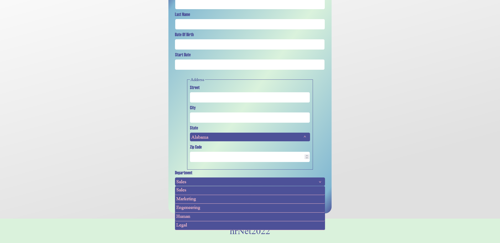

#dk_select_package

dk_select_package is a customisable select input

###EXAMPLE OF A STYLIZED RENDERING



## Installation

`npm i dk_select_package`


## Usage

This package is made for use in a react application like a registration form for example

## Example

In this example we want to see the name of the state selected but also the abbreviation of this state for db traitements, we will import an array of just 3 states containing a name and an abbreviation :


## Array of states
```
export const states = [
  {
    name: "Alabama",
    abbreviation: "AL",
  },
  {
    name: "Alaska",
    abbreviation: "AK",
  },
  {
    name: "American Samoa",
    abbreviation: "AS",
  }
]
```

## Package usage
```
import React, { useState } from "react"
import { SelectDk } from "dk_select_package" 
import {states} from './folder of states array'

const form = () => {


  const [selectIsOpen, setSelectIsOpen] = useState(false) // false if option close true if open
  const [stateName,setStateName] = useState('Alabama') // visible value in the select area (put a default value) change after choosen option
  const [stateAbb,setStateAbb] = useState('AL) // state abbreviation used in data base in this example
  const closeSelect = () => selectIsOpen && setStateOpen(false) // close the option container when click outside 

  // update the state stateString value (name in the object array of states) and the stateValue (abbreviation in the objects array of states)
  const updateState = (data) => {
    setStateAbb(data.value)
    setStateName(data.label)
  }
   

  return (
    <form>
      <SelectDk
          datas={states.map((el) => ({
              value: el.abbreviation,
              label: el.name, // !REQUIRE you must have a label parameter in your map object
            }))}
          update={updateState}
          visibleValue={stateName}
          open={selectIsOpen}
          setOpen={setSelectIsOpen}
      />
    
    </form>
  )
}


```

## Inline Style Package

You can change all the package style whith a css file but if you won't create css file you can use the inline style like this 

```
 <SelectDk
            datas={states.map((el) => ({
              value: el.abbreviation,
              label: el.name,
            }))}
            update={updateState}
            visibleValue={stateString}
            open={stateOpen}
            setOpen={setStateOpen}
            // for change the select input style
            listBoxStyle={{ color: "white", background: "red" }} 
            // for change the options container style
            optionsContainerStyle={{
              scrollbarColor: " darkBlue pink",
              backgroundColor: "white",
            }}
            // for change the options style (only backgroundColor and color)
            optionsStyle={{
              backgroundColor: "white",
              color: "orange",
            }}
            // for change the options style when they hover  (only backgroundColor and color)
            hoverOptionsStyle={{
              backgroundColor: "orange",
              color: "white",
            }}
 />
```
